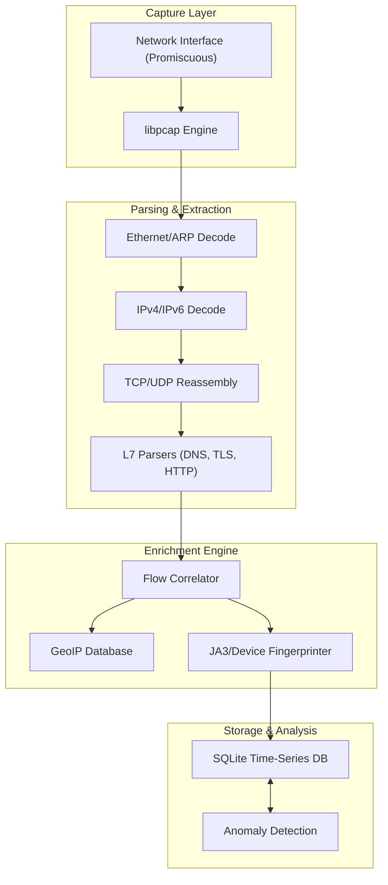

# NetScope

<p align="center">
  
  
  
</p>

<p align="center">
  
  
  
</p>

**NetScope** is a passive network observatory and traffic analysis platform designed for academic research and security monitoring. It provides real-time visibility into network flows, correlating raw packet data with high-level identity providers (DNS, TLS SNI, GeoIP) to construct a comprehensive view of device behavior without requiring decryption.

---

## Architecture

NetScope functions as a multi-stage pipeline, transforming raw wire data into structured intelligence.



## Key Features

### Traffic Analysis

- **Protocol Dissection**: Deep packet inspection for Ethernet, IPv4/6, TCP, UDP, DNS, TLS (ClientHello), and HTTP/1.1.
- **TLS Fingerprinting**: JA3 hashing of TLS Client Hellos to identify client applications (isolating malware/bots from browsers).
- **Flow Tracking**: 5-tuple connection tracking with stateful analysis (SYN/ACK/FIN patterns).

### Network Intelligence

- **Passive Device Discovery**: Identifies devices via MAC OUI, DHCP option parsing, and distinct traffic patterns.
- **DNS Correlation**: Maps ephemeral IP connections back to their initiating DNS queries for human-readable hostname resolution.
- **GeoIP Enrichment**: Integrated MaxMind GeoLite2 support for physical location tagging of remote endpoints.

### Application Layer

- **No Decryption Required**: Analyzes side-channel metadata (SNI, Certs, Packet Timing) to infer user activity while respecting encryption.
- **Privacy Analysis**: Detects connections to known trackers, ad networks, and telemetry endpoints.

## Documentation

Comprehensive documentation is available in the `docs/` directory:

| Document | Description |
|----------|-------------|
| [**Architecture**](docs/architecture.md) | System design, pipeline stages, and concurrent processing model. |
| [**Protocol Parsing**](docs/protocol-parsing.md) | Details on supported protocols and dissection logic. |
| [**API Reference**](docs/api.md) | Internal and External API endpoints for data retrieval. |
| [**Deployment**](docs/deployment.md) | Compilation, installation, and capability management. |

## Getting Started

### Prerequisites

- **Go 1.21+** Toolchain
- **libpcap-dev** headers
- **CGO** enabled environment

### Build Instructions

```bash
# Clone the repository
git clone https://github.com/kleaSCM/netscope.git
cd netscope

# Install dependencies
go mod download

# Build the binary
go build -o bin/netscope ./cmd/netscope
```

### Usage

```bash
# List interfaces
sudo ./bin/netscope interfaces

# Start capture on eth0
sudo ./bin/netscope capture --interface eth0
```

## Project Structure

```
netscope/
├── cmd/
│   ├── netscope/       # CLI entrypoint
│   └── web/            # Web dashboard server
├── internal/
│   ├── capture/        # libpcap wrapper and ring buffers
│   ├── parser/         # Protocol dissection logic (L2-L7)
│   ├── correlator/     # State tracking and flow mapping
│   ├── enricher/       # External data lookup (GeoIP, OUI)
│   ├── analyzer/       # Anomaly detection algorithms
│   └── storage/        # SQLite database interface
├── pkg/
│   └── api/            # Public types and interfaces
├── docs/               # Technical documentation
└── scripts/            # Build and deploy scripts
```

## License

MIT License — see LICENSE file for details.

## Contact

For questions and support: <KleaSCM@gmail.com>
